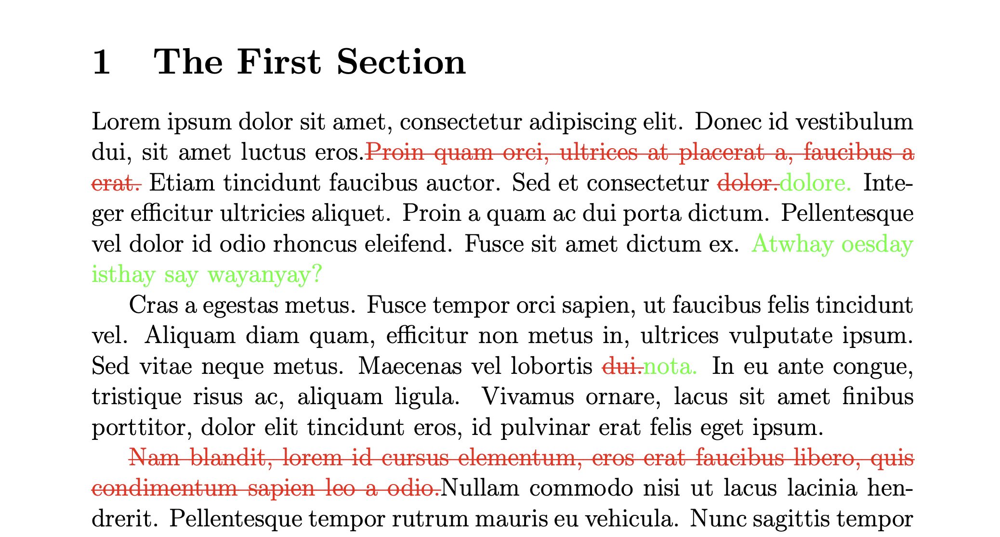

# slashdiff

Minimal pretty track-changes for LaTeX. Finally, a `git diff` nice enough to
hang on a wall! Highlights additions and deletions without getting confused by
trivial changes in line wrapping in your `.tex` files.



## Usage

Usage is simple: specify the old and new versions of the document and where to
place output. Includes necessary packages for change highlighting when used
with the `-s`/`--standalone` option so a PDF can be produced directly.

```
slashdiff oldversion.tex newversion.tex -so changes.tex \
    && pdflatex changes
```

See `slashdiff --help` for more details.

## Installation

### From source

```
git clone https://github.com/efharkin/slashdiff.git \
    && cd slashdiff && sh ./install.sh
```

Use `sh ./uninstall.sh` later to uninstall.

### Requirements

`python3` and `git` in your `PATH`. Probably also a good idea to have some kind
of LaTeX compiler.
